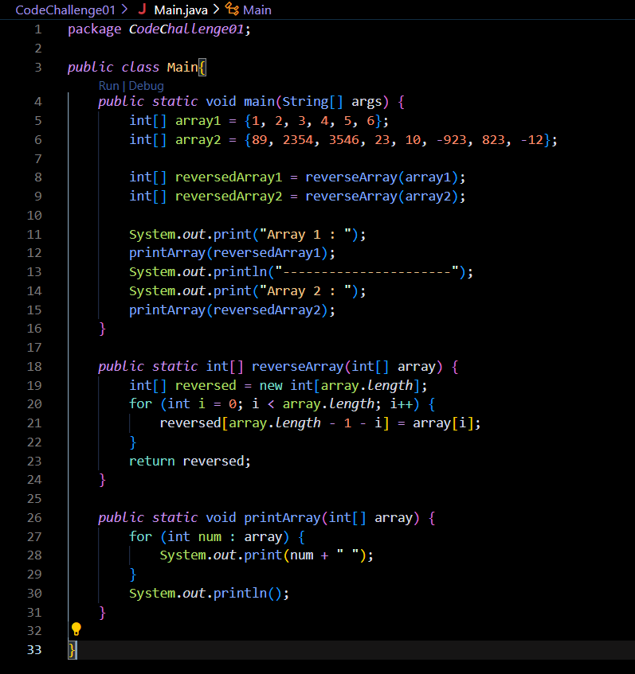
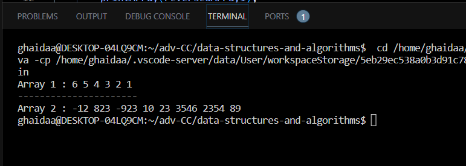

# Reverse an array

---

## Description of the challenge 

The challenge is to create a function called reverseArray that takes an array as an argument and returns a new array with elements in reversed order. The challenge emphasizes adhering to the Single-responsibility principle and creating clean, reusable, and abstract components for the solution.

---

## Whiteboard 

#### Whiteboard pic

---

## Approach & Efficiency

The approach taken is to iterate through the input array and populate a new array with elements in reversed order. The time complexity of this approach is O(n), where n is the length of the input array, since we need to iterate through each element of the array. The space complexity is also O(n), as we are creating a new array to store the reversed elements.

---

## Solution

### Code

### Output

