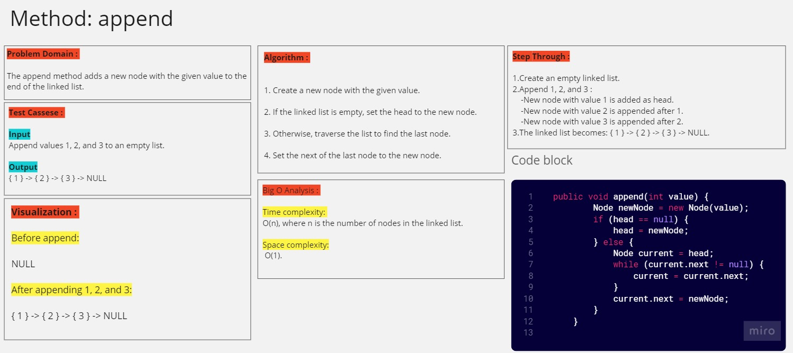
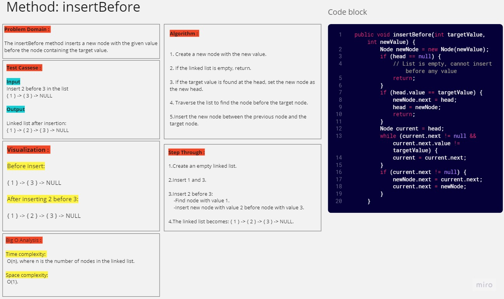
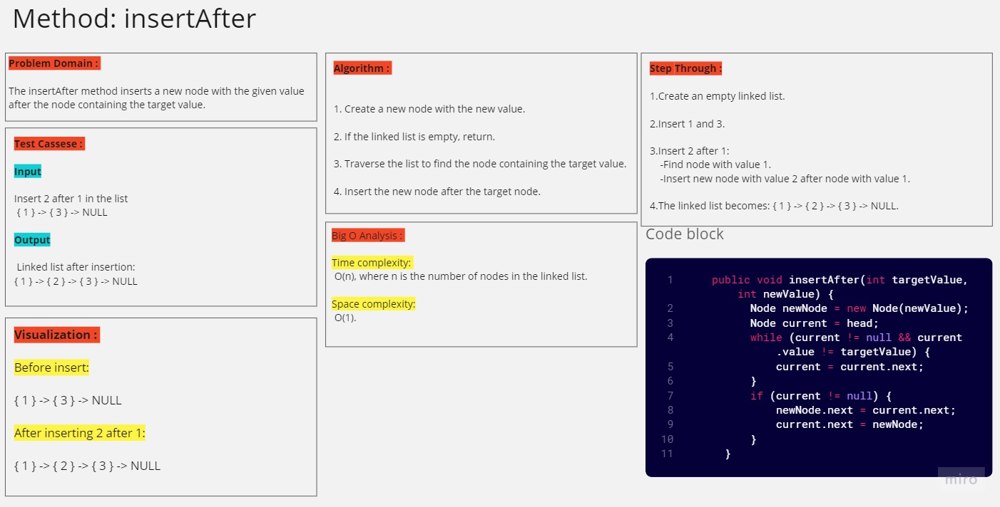

# Linked Lists (class06)

---

## Description of the challenge

The challenge is to implement a singly linked list class that supports three methods: append, insertBefore, and insertAfter. The append method adds a new node with the given value to the end of the linked list. The insertBefore method inserts a new node with the given value before the node containing the target value. The insertAfter method inserts a new node with the given value after the node containing the target value.

---

## Whiteboard

#### Whiteboard pic






---

## Approach & Efficiency

For all three methods, the general approach involves creating a new node with the desired value and adjusting the connections between nodes accordingly.

1. Append:

- Create a new node with the given value.
- If the linked list is empty, set the head to the new node. 
- Otherwise, traverse the list to find the last node. 
- Set the next of the last node to the new node.

2. InsertBefore:

- Create a new node with the new value.
- If the linked list is empty, return.
- If the target value is found at the head, set the new node as the new head.
- Traverse the list to find the node before the target node.
- Insert the new node between the previous node and the target node.

3. InsertAfter:

- Create a new node with the new value.
- If the linked list is empty, return.
- Traverse the list to find the node containing the target value.
- Insert the new node after the target node.

### Time Complexity:

For all methods, the main time-consuming operation is traversing the list to find a specific node or the last node:

- Traversing the list to find the last node: O(n)
- Traversing the list to find the previous node or the target node: O(n)

### Space Complexity:

The space complexity remains relatively low as we're primarily creating a new node for each operation:

- Creating a new node: O(1)
- Overall space complexity: O(1)

---

## Solution

### Code

#### Node

```java
public class Node {

    public int value;
    public Node next;

    public Node(int value) {
        this.value = value;
        this.next = null;
    }
}
```

#### linkedList

```java
public class LinkedList {
    public Node head;

    public LinkedList() {
        this.head = null;
    }

    public void insert(int value) {
        Node newNode = new Node(value);
        newNode.next = head;
        head = newNode;
    }

    public boolean includes(int value) {
        Node current = head;
        while (current != null) {
            if (current.value == value) {
                return true;
            }
            current = current.next;
        }
        return false;
    }

    public void append(int value) {
        Node newNode = new Node(value);
        if (head == null) {
            head = newNode;
        } else {
            Node current = head;
            while (current.next != null) {
                current = current.next;
            }
            current.next = newNode;
        }
    }

    public void insertBefore(int targetValue, int newValue) {
        Node newNode = new Node(newValue);
        if (head == null) {
            // List is empty, cannot insert before any value
            return;
        }
        if (head.value == targetValue) {
            newNode.next = head;
            head = newNode;
            return;
        }
        Node current = head;
        while (current.next != null && current.next.value != targetValue) {
            current = current.next;
        }
        if (current.next != null) {
            newNode.next = current.next;
            current.next = newNode;
        }
    }

    public void insertAfter(int targetValue, int newValue) {
        Node newNode = new Node(newValue);
        Node current = head;
        while (current != null && current.value != targetValue) {
            current = current.next;
        }
        if (current != null) {
            newNode.next = current.next;
            current.next = newNode;
        }
    }
    
    public String toString() {
        StringBuilder result = new StringBuilder();
        Node current = head;
        while (current != null) {
            result.append("{ ").append(current.value).append(" } -> ");
            current = current.next;
        }
        result.append("NULL");
        return result.toString();
    }
}
```