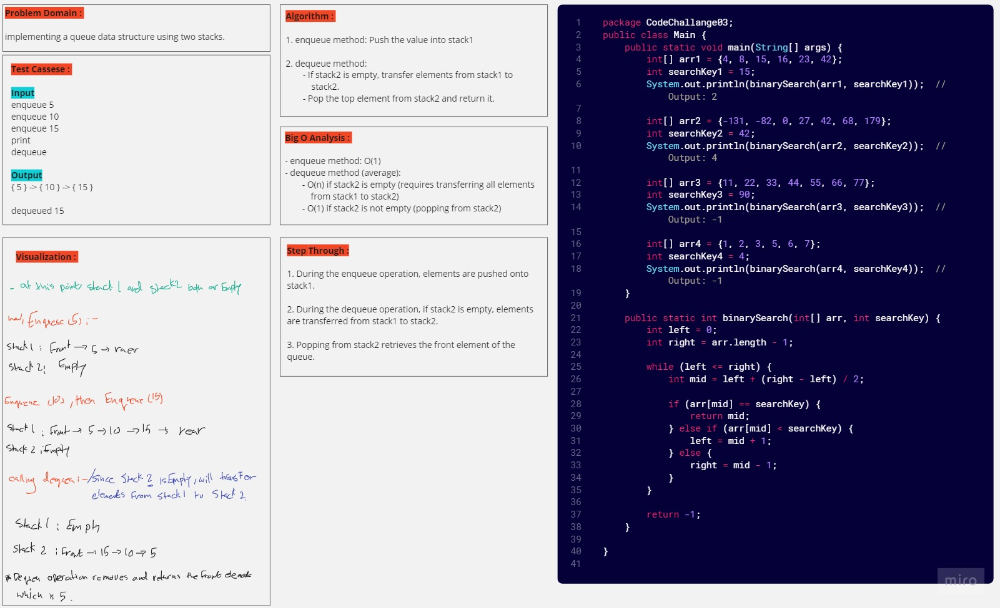
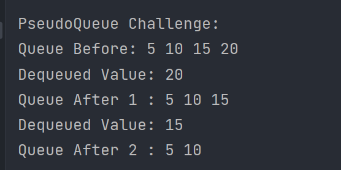

# PseudoQueue (Challenge 11)

---

## Description of the challenge

The challenge is to implement a queue using two stacks (stack1 and stack2). The enqueue method should insert values into the queue using a first-in, first-out (FIFO) approach, and the dequeue method should extract values from the queue following the same FIFO approach.

---

## Whiteboard



---

## Approach & Efficiency

The PseudoQueue class uses two stacks (stack1 and stack2) to implement the queue. The enqueue method pushes elements onto stack1, and the dequeue method pops elements from stack2. If stack2 is empty during a dequeue operation, the code transfers elements from stack1 to stack2 to maintain the FIFO order.

The efficiency of this implementation depends on the size of the input. The enqueue operation has a time complexity of O(1) because it directly pushes elements onto stack1. The dequeue operation has an average time complexity of O(n) if stack2 is empty, where n is the number of elements in the queue. This is because it may need to transfer all elements from stack1 to stack2 before performing the dequeue operation.


---

## Solution

### Output



#### code

[PseudoQueueCode](./lib/src/main/java/stackqueue/queue/PseudoQueue.java)

```java
public class PseudoQueue<T> {
    public Stack<T> stack1;
    public Stack<T> stack2;

    public PseudoQueue() {
        this.stack1 = new Stack<>();
        this.stack2 = new Stack<>();
    }

    public void enqueue(T value) {
        stack1.push(value);
    }

    public T dequeue() {
        if (stack2.isEmpty()) {
            while (!stack1.isEmpty()) {
                stack2.push((T) stack1.pop());
            }
        }

        return stack2.pop();
    }

    public boolean isEmpty() {
        return stack1.isEmpty() && stack2.isEmpty();
    }

    @Override
    public String toString() {
        if (isEmpty()) {
            return "PseudoQueue is empty.";
        }

        StringBuilder sb = new StringBuilder("PseudoQueue: ");

        Stack<T> tempStack = new Stack<>();
        while (!stack2.isEmpty()) {
            tempStack.push(stack2.pop());
        }
        while (!tempStack.isEmpty()) {
            T value = tempStack.pop();
            sb.append(value).append(" ");
            stack2.push(value);
        }

        while (!stack1.isEmpty()) {
            T value = stack1.pop();
            sb.append(value).append(" ");
            stack2.push(value);
        }

        return sb.toString().trim();
    }
}
```
