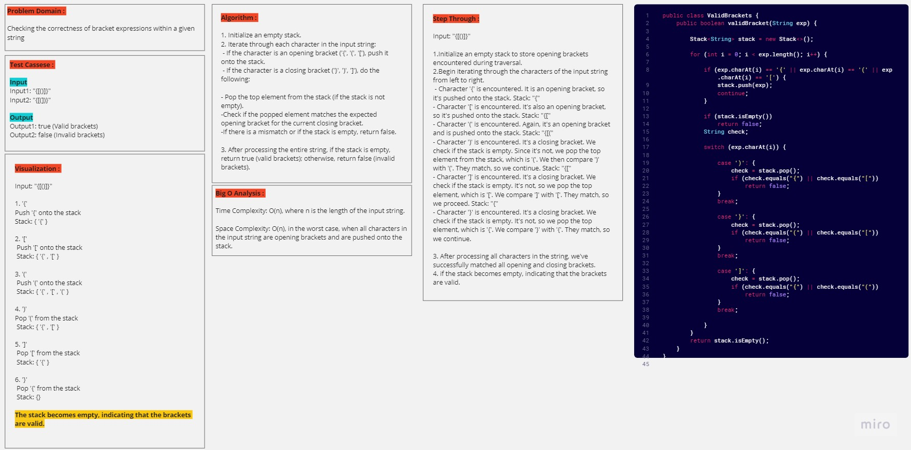
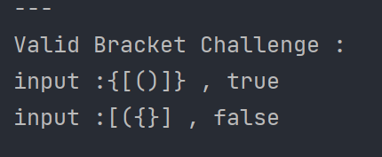

# Valid Brackets (Challenge 13)

---

## Description of the challenge

The challenge is to determine if a given string containing brackets ('{', '}', '(', ')', '[', ']') is valid. A valid string of brackets must have the following properties:

- Open brackets must be closed by the same type of brackets.
- Open brackets must be closed in the correct order.
- An empty string is also considered valid.

---

## Whiteboard

#### Whiteboard pic



---

## Approach & Efficiency

The approach used in the `ValidBrackets` class is to use a stack to keep track of the opening brackets encountered. When a closing bracket is encountered, it is checked against the top of the stack to see if it matches the corresponding opening bracket. If a mismatch is found at any point or if the stack is not empty after processing the entire string, the string is considered invalid.

---

## Solution

### Output



#### Code

[ValidBracketsCode](StackAndQueue/lib/src/main/java/stackqueue/stack/ValidBrackets.java)

```java
public class ValidBrackets {
    public boolean validBracket(String exp) {

        Stack<String> stack = new Stack<>();

        for (int i = 0; i < exp.length(); i++) {

            if (exp.charAt(i) == '{' || exp.charAt(i) == '(' || exp.charAt(i) == '[') {
                stack.push(exp);
                continue;
            }

            if (stack.isEmpty())
                return false;
            String check;

            switch (exp.charAt(i)) {

                case ')': {
                    check = stack.pop();
                    if (check.equals("{") || check.equals("["))
                        return false;
                }
                break;

                case '}': {
                    check = stack.pop();
                    if (check.equals("(") || check.equals("["))
                        return false;
                }
                break;

                case ']': {
                    check = stack.pop();
                    if (check.equals("{") || check.equals("("))
                        return false;
                }
                break;

            }
        }
        return stack.isEmpty();
    }
}

```