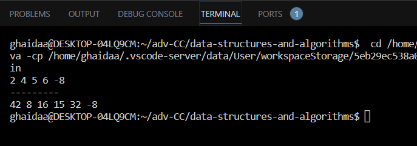

# Insert and shift an array in middle at index

---

## 
Description of the challenge
The challenge is to create a function called insertShiftArray that takes an array and a value(index) as an arguments and returns a new array theat has a copy of the elements of the array as well as the value(index) inserted to the middle of the array.

---

## Whiteboard 

#### Whiteboard pic

.jpg)

---

## Approach & Efficiency

This code takes an array and an index to insert, then creates a new array to accommodate the insertion. It copies elements from the original array to the new array, inserting the index at the middle position.

Approach: 
Calculate the middle index of the original array. Create a new array with a length of the original array's length plus one. Copy elements from the original array to the new array until the middle index, insert the index at the middle, and continue copying the remaining elements from the original array.

Efficiency:
Time Complexity: The code iterates through the original array twice: once for the first half and once for the second half. Each iteration takes O(n/2) time, and when combined, this results in O(n) time complexity, where n is the input array's length.
Space Complexity: A new array of length n+1 is created to hold the modified elements, resulting in O(n) space complexity. Additional constant space is used for variables and indices.

---

## Solution

### Code

     `public static int[] insertShiftArray(int[] arr, int index) {
        int insertToMiddle = arr.length / 2;
        int[] finalArr = new int[arr.length + 1];
        for (int i = 0; i < insertToMiddle; i++) {
            finalArr[i] = arr[i];
        }

        finalArr[insertToMiddle] = index;

        for (int i = insertToMiddle + 1; i < finalArr.length; i++) {
            finalArr[i] = arr[i - 1];
        }

        return finalArr;

    }`

### Output

