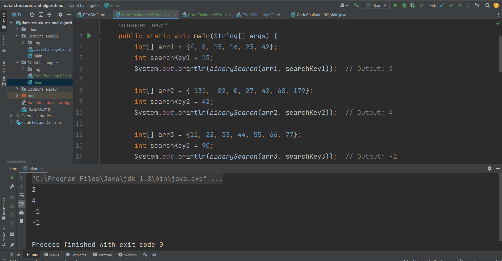

# Binary search in a sorted 1D array

---

## Description of the challenge

The challenge is to implement a binary search algorithm to find the index of a given search key in a sorted 1D array. The BinarySearch function takes in two parameters: a sorted array and the search key. It should return the index of the array element that is equal to the value of the search key, or -1 if the element is not in the array.

---

## Whiteboard

#### Whiteboard pic

---

## Approach & Efficiency

### Approach:

The binary search algorithm is used to efficiently find the index of a given search key in a sorted 1D array. It follows these steps:

1. Initialize left and right pointers to define the search range within the array.
2. While left is less than or equal to right, calculate the middle index (mid) of the current range.
3. Compare the element at index mid with the search key:
- If equal, return mid as the index of the search key.
- If less, update left = mid + 1 to search the right half.
- If greater, update right = mid - 1 to search the left half.
4. Repeat steps 2-3 until the search range is exhausted.

### Efficiency:

- Time Complexity: O(log n)
With each comparison, the search range is halved, leading to rapid convergence to the desired element.
The time complexity of binary search is logarithmic because it divides the search space by half in each step.

- Space Complexity: O(1)
Binary search uses a constant amount of extra space for the pointers and variables, making it memory-efficient.

---

## Solution

### Code

     `public static int binarySearch(int[] arr, int searchKey) {
        int left = 0;
        int right = arr.length - 1;

        while (left <= right) {
            int mid = left + (right - left) / 2;

            if (arr[mid] == searchKey) {
                return mid;
            } else if (arr[mid] < searchKey) {
                left = mid + 1;
            } else {
                right = mid - 1;
            }
        }

        return -1;
    }`

### Output

