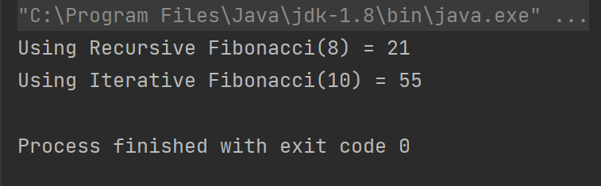

# Mock Interviews

---

## Description of the challenge

This challenge is about doing a Mock Interviews with one of the classmates, in my case I've done this interview with my classmate Balqees  

---

## Whiteboard

#### Whiteboard pic

---

## Approach & Efficiency

## Recursive Solution:

#### Approach:

The recursive solution calculates the Nth Fibonacci number by breaking the problem into subproblems. 
It calculates the Fibonacci number at position N by recursively calculating the Fibonacci numbers at positions N-1 and N-2, which in turn recursively calculate the Fibonacci numbers for their previous positions, and so on.

#### Efficiency:

- Time Complexity: O(2^n)

- Space Complexity:  O(n)

---

## Solution

### Code

     `public static int recursiveFibonacci(int n) {
        if (n <= 1) {
            return n;
        }
        return recursiveFibonacci(n - 1) + recursiveFibonacci(n - 2);
    }`

### Output

## Iterative Solution:

#### Approach:

The iterative solution builds the Fibonacci sequence iteratively, avoiding redundant calculations. 
It uses an array to store previously calculated Fibonacci numbers and calculates the current number based on the sum of the last two numbers.

#### Efficiency:

- Time Complexity: O(n)

- Space Complexity:  O(n)

---

## Solution

### Code

     `public static int iterativeFibonacci(int n) {
        if (n <= 1) {
            return n;
        }
        int prev1 = 0;
        int prev2 = 1;
        int current = 0;
        for (int i = 2; i <= n; i++) {
            current = prev1 + prev2;
            prev1 = prev2;
            prev2 = current;
        }
        return current;
    }`

### Output

