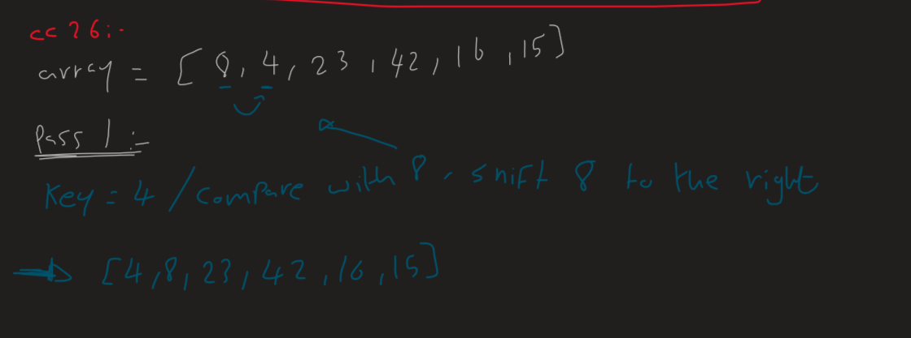
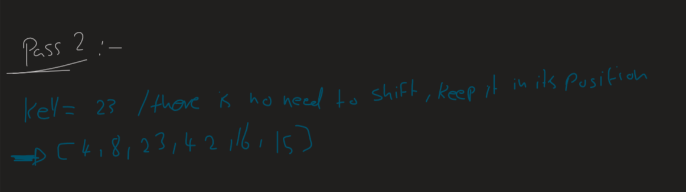
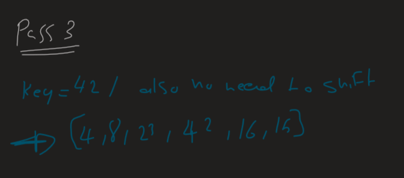
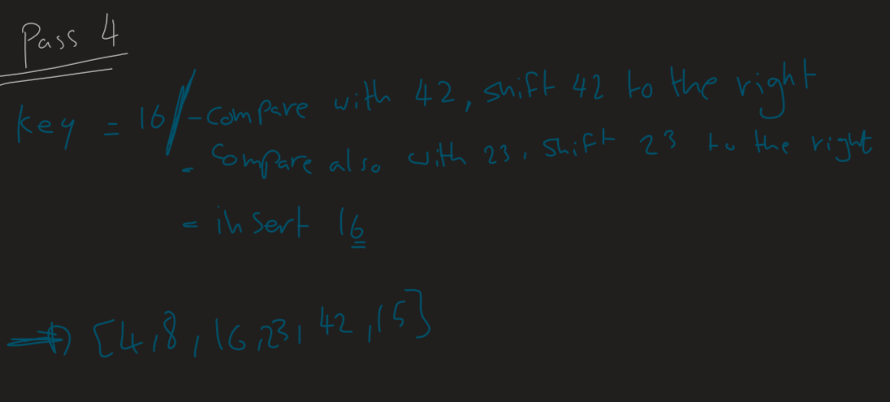
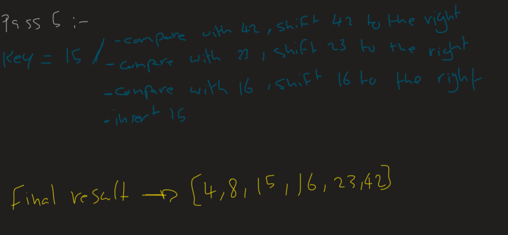

# Selection Sort


The insertionSort method employs the Insertion Sort algorithm to sort an integer array in ascending order. 
It iterates through the array, placing each element in its correct position within the growing sorted subarray. Despite its O(n^2) worst-case time complexity, Insertion Sort is efficient for small or partially sorted arrays. The accompanying try-catch block, catching IllegalArgumentException, seems redundant since the method doesn't throw this exception. It's generally preferable to handle exceptions that might arise during sorting more specifically.

---

# Pseudocode

```
Insert(int[] sorted, int value)
  initialize i to 0
  WHILE value > sorted[i]
    set i to i + 1
  WHILE i < sorted.length
    set temp to sorted[i]
    set sorted[i] to value
    set value to temp
    set i to i + 1
  append value to sorted

InsertionSort(int[] input)
  LET sorted = New Empty Array
  sorted[0] = input[0]
  FOR i from 1 up to input.length
    Insert(sorted, input[i])
  return sorted
```

---

# Code

```java
   public class InsertionSortClass {
    public void insertionSort(int[] arr) throws Exception {
        try {
            int length = arr.length;
            for (int i = 1; i < length; ++i) {
                int key = arr[i];
                int j = i - 1;
                while (j >= 0 && arr[j] > key) {
                    arr[j + 1] = arr[j];
                    j = j - 1;
                }
                arr[j + 1] = key;
            }
        } catch (IllegalArgumentException e) {
            e.printStackTrace();
        }
    }
}
```

---

# Trace











---

# Big (O)

- Time complexity: O(n^2) in the worst case. This is because, for each element in the array, it may need to traverse the entire sorted subarray before finding the correct position.

- Space complexity: O(1) because it uses a constant amount of extra space for variables such as key, j, and length. It doesn't require additional memory allocation proportional to the size of the input array. The space complexity is considered in-place, making it suitable for scenarios with limited memory resources.
