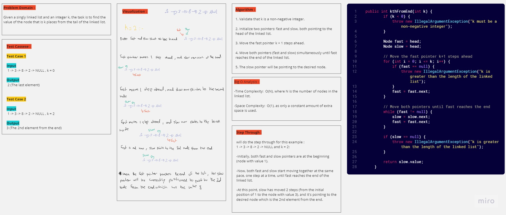

# Linked Lists (Challenge 07)

---

## Description of the challenge

The challenge is to find the value of the node that is k places from the end of the linked list, where k is a non-negative integer. If k is greater than or equal to the length of the linked list, an exception should be thrown. The goal is to implement an efficient solution that works for various scenarios.

---

## Whiteboard

#### Whiteboard pic



---

## Approach & Efficiency

- The approach involves using two pointers, fast and slow, to traverse the linked list. 
- The fast pointer is moved k + 1 steps ahead, ensuring that there are k nodes between the fast and slow pointers. 
- Then both pointers move together until fast reaches the end of the linked list. The slow pointer will be pointing to the desired node.

The algorithm has a time complexity of O(N) and a space complexity of O(1), making it an efficient solution for finding the kth node from the end of the linked list.

---

## Solution

### Code

#### Node

```java
public class Node {

    public int value;
    public Node next;

    public Node(int value) {
        this.value = value;
        this.next = null;
    }
}
```

#### linkedList

```java
public class LinkedList {
    public Node head;

    public LinkedList() {
        this.head = null;
    }

    public void insert(int value) {
        Node newNode = new Node(value);
        newNode.next = head;
        head = newNode;
    }

    public boolean includes(int value) {
        Node current = head;
        while (current != null) {
            if (current.value == value) {
                return true;
            }
            current = current.next;
        }
        return false;
    }

    public void append(int value) {
        Node newNode = new Node(value);
        if (head == null) {
            head = newNode;
        } else {
            Node current = head;
            while (current.next != null) {
                current = current.next;
            }
            current.next = newNode;
        }
    }

    public void insertBefore(int targetValue, int newValue) {
        Node newNode = new Node(newValue);
        if (head == null) {
            // List is empty, cannot insert before any value
            return;
        }
        if (head.value == targetValue) {
            newNode.next = head;
            head = newNode;
            return;
        }
        Node current = head;
        while (current.next != null && current.next.value != targetValue) {
            current = current.next;
        }
        if (current.next != null) {
            newNode.next = current.next;
            current.next = newNode;
        }
    }

    public void insertAfter(int targetValue, int newValue) {
        Node newNode = new Node(newValue);
        Node current = head;
        while (current != null && current.value != targetValue) {
            current = current.next;
        }
        if (current != null) {
            newNode.next = current.next;
            current.next = newNode;
        }
    }
    
    //Challenge 07
    public int kthFromEnd(int k) {
        if (k < 0) {
            throw new IllegalArgumentException("k must be a non-negative integer");
        }

        Node fast = head;
        Node slow = head;

        // Move the fast pointer k+1 steps ahead
        for (int i = 0; i <= k; i++) {
            if (fast == null) {
                throw new IllegalArgumentException("k is greater than the length of the linked list");
            }
            fast = fast.next;
        }

        // Move both pointers until fast reaches the end
        while (fast != null) {
            slow = slow.next;
            fast = fast.next;
        }

        if (slow == null) {
            throw new IllegalArgumentException("k is greater than the length of the linked list");
        }

        return slow.value;
    }
    
    public String toString() {
        StringBuilder result = new StringBuilder();
        Node current = head;
        while (current != null) {
            result.append("{ ").append(current.value).append(" } -> ");
            current = current.next;
        }
        result.append("NULL");
        return result.toString();
    }
}
```