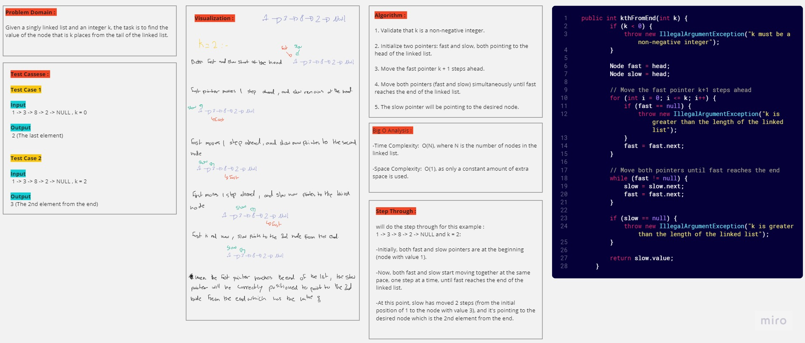

# Linked Lists (Challenge 08)

---

## Description of the challenge

The challenge is to merge two singly linked lists alternately, creating a new linked list where elements from the two input lists are interleaved.

---

## Whiteboard

#### Whiteboard pic



---

## Approach & Efficiency

The approach involves iterating through both input linked lists simultaneously and appending their values alternately to a new linked list. 
The time complexity of this algorithm is O(n), where n is the total number of elements in the two input linked lists.

---

## Solution

### Code

#### Node

```java
public class Node {

    public int value;
    public Node next;

    public Node(int value) {
        this.value = value;
        this.next = null;
    }
}
```

#### linkedList

```java
public class LinkedList {
    public Node head;

    public LinkedList() {
        this.head = null;
    }

    public void append(int value) {
        Node newNode = new Node(value);
        if (head == null) {
            head = newNode;
        } else {
            Node current = head;
            while (current.next != null) {
                current = current.next;
            }
            current.next = newNode;
        }
    }
    
    public SinglyLinkedList zipLists(SinglyLinkedList li1, SinglyLinkedList li2){
        SinglyLinkedList zippedList = new SinglyLinkedList();

        Node current1 = li1.head;
        Node current2 = li2.head;

        while (current1 != null && current2 != null){
            zippedList.append(current1.value);
            zippedList.append(current2.value);

            current1 = current1.next;
            current2 = current2.next;
        }

        while (current1 != null){
            zippedList.append(current1.value);

            current1 = current1.next;
        }

        while (current2 != null){
            zippedList.append(current2.value);

            current2 = current2.next;
        }

        return zippedList;
    }    
    
    public String toString() {
        StringBuilder result = new StringBuilder();
        Node current = head;
        while (current != null) {
            result.append("{ ").append(current.value).append(" } -> ");
            current = current.next;
        }
        result.append("NULL");
        return result.toString();
    }
}
```