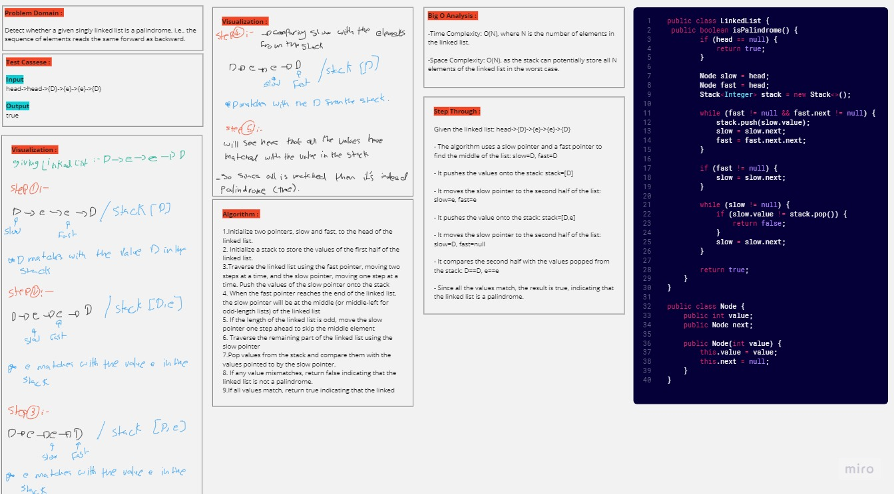
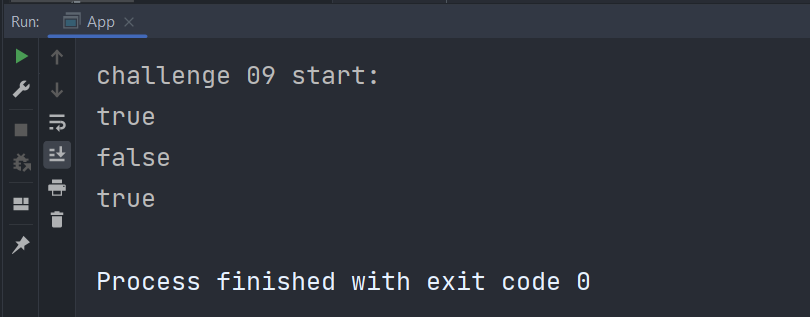

# Linked Lists (Challenge 08)

---

## Description of the challenge

The challenge is to merge two singly linked lists alternately, creating a new linked list where elements from the two input lists are interleaved.

---

## Whiteboard

#### Whiteboard pic



---

## Approach & Efficiency

The approach involves iterating through both input linked lists simultaneously and appending their values alternately to a new linked list.
The time complexity of this algorithm is O(n), where n is the total number of elements in the two input linked lists.

---

## Solution

### Output



#### Input

```java
public class App{
    public static void main(String[]args){

        SinglyLinkedList isPalindrome = new SinglyLinkedList();
        isPalindrome.append('t');
        isPalindrome.append('a');
        isPalindrome.append('c');
        isPalindrome.append('o');
        isPalindrome.append('c');
        isPalindrome.append('a');
        isPalindrome.append('t');

        SinglyLinkedList isPalindrome2 = new SinglyLinkedList();
        isPalindrome2.append('g');
        isPalindrome2.append('h');
        isPalindrome2.append('a');
        isPalindrome2.append('i');
        isPalindrome2.append('d');
        isPalindrome2.append('a');
        isPalindrome2.append('a');

        SinglyLinkedList l = new SinglyLinkedList();
        l.append('D');
        l.append('e');
        l.append('e');
        l.append('D');

        System.out.println(isPalindrome.isPalindrome());
        System.out.println(isPalindrome2.isPalindrome());
        System.out.println(l.isPalindrome());
    }   
}
```


