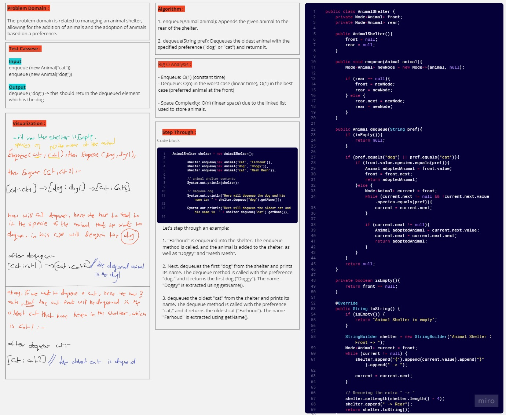

# PseudoQueue (Challenge 11)

---

## Description of the challenge

implement an Animal Shelter system that allows you to enqueue (add) animals to the shelter and dequeue (adopt) animals based on a preference.
The preference can be either "dog" or "cat".

---

## Whiteboard



---

## Approach & Efficiency

#### Enqueue:

- To enqueue an animal, the code creates a new Node and adds it to the rear of the shelter. It updates the front and rear pointers accordingly.
- This operation has a time complexity of O(1) because it involves basic pointer manipulation.

#### Dequeue:

- To dequeue an animal with a specified preference, the code checks if the shelter is empty. If it's not empty, it iterates through the linked list starting from the front until it finds an animal of the specified preference.
- This operation has a time complexity of O(n) in the worst case, where n is the number of animals in the shelter. In the best case (if the preferred animal is at the front), it's O(1).

---

## Solution

### Output


#### code

```java
public class Animal {

    String species;
    String name;

    public Animal(String species, String name) {
        this.species = species;
        this.name = name;
    }

    public String getName() {
        return name;
    }

    @Override
    public String toString() {
        return species + ": " + name;
    }
}

public class AnimalShelter {
    private Node<Animal> front;
    private Node<Animal> rear;

    public AnimalShelter(){
        front = null;
        rear = null;
    }

    public void enqueue(Animal animal){
        Node<Animal> newNode = new Node<>(animal, null);

        if (rear == null){
            front = newNode;
            rear = newNode;
        } else {
            rear.next = newNode;
            rear = newNode;
        }
    }

    public Animal dequeue(String pref){
        if (isEmpty()){
            return null;
        }

        if (pref.equals("dog") || pref.equals("cat")){
            if (front.value.species.equals(pref)){
                Animal adoptedAnimal = front.value;
                front = front.next;
                return adoptedAnimal;
            }else {
                Node<Animal> current = front;
                while (current.next != null && !current.next.value.species.equals(pref)){
                    current = current.next;
                }

                if (current.next != null){
                    Animal adoptedAnimal = current.next.value;
                    current.next = current.next.next;
                    return adoptedAnimal;
                }
            }
        }
        return null;
    }

    private boolean isEmpty(){
        return front == null;
    }

    @Override
    public String toString() {
        if (isEmpty()) {
            return "Animal Shelter is empty";
        }

        StringBuilder shelter = new StringBuilder("Animal Shelter : Front -> ");
        Node<Animal> current = front;
        while (current != null) {
            shelter.append("{").append(current.value).append("}").append(" -> ");

            current = current.next;
        }

        // Removing the extra " -> "
        shelter.setLength(shelter.length() - 4);
        shelter.append(" -> Rear");
        return shelter.toString();
    }
}


```
