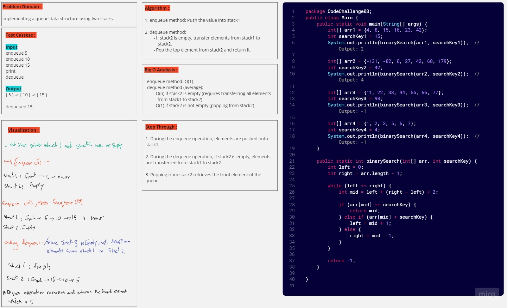
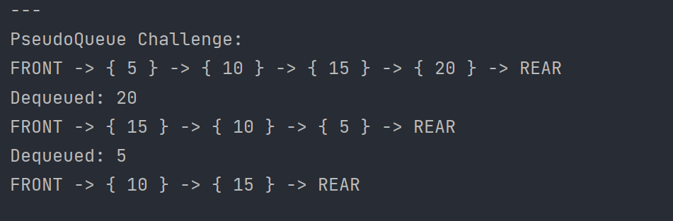

# DuckDuckGoose (Challenge 14) 

---

## Description of the challenge

The challenge is to implement a variation of the "Duck, Duck, Goose" game using a queue. 
In this game, you have an array of players, and a number 'k'. Players sit in a circle, and you start counting from the first player. When you reach 'k', the player is "Goose," and you remove them from the circle. This process repeats until only one player is left, who is the winner. The function duckDuckGoose takes an array of players and 'k' as input and returns the name of the last player remaining.

---

## Whiteboard



---

## Approach & Efficiency

- The code uses a queue to simulate the circle of players.
- It enqueues all players into the queue initially.
- Then, it repeatedly dequeues and enqueues players in a loop until only one player remains.
- The time complexity of this approach is O(N*K), where N is the number of players, and K is the value of 'k'.

---

## Solution

### Output



#### code

```java
public class PseudoQueue<T> {
    public Stack<T> stack1;
    public Stack<T> stack2;

    public PseudoQueue() {
        this.stack1 = new Stack<>();
        this.stack2 = new Stack<>();
    }

    public void enqueue(T value) {
        stack1.push(value);
    }

    public T dequeue() {
        if (stack2.isEmpty()) {
            while (!stack1.isEmpty()) {
                stack2.push((T) stack1.pop());
            }
        }

        return stack2.pop();
    }

    public boolean isEmpty() {
        return stack1.isEmpty() && stack2.isEmpty();
    }

    @Override
    public String toString() {
        if (isEmpty()) {
            return "Queue is empty";
        }

        StringBuilder allValues = new StringBuilder();
        allValues.append("FRONT -> ");

        Stack<T> tempStack = new Stack<>();

        if (stack2.isEmpty()) {
            while (!stack1.isEmpty()) {
                stack2.push(stack1.pop());
            }
        }

        while (!stack2.isEmpty()) {
            T value = stack2.pop();
            allValues.append("{ ").append(value).append(" } -> ");
            tempStack.push(value);
        }

        while (!tempStack.isEmpty()) {
            stack1.push(tempStack.pop());
        }

        allValues.append("REAR");
        return allValues.toString();
    }

}

```
