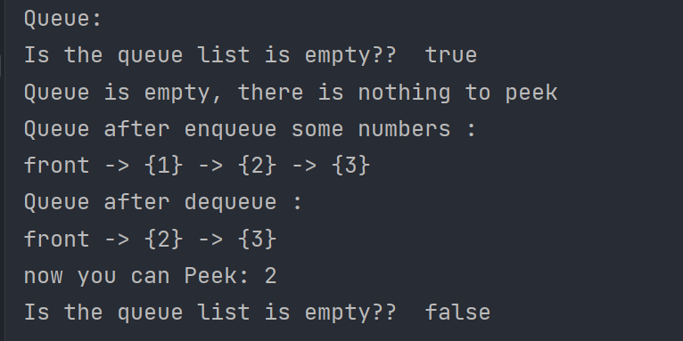
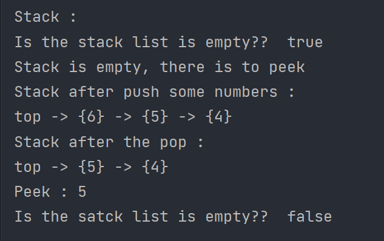

# Stack And Queue (Challenge 10)

---

# Queue

---

## Description of the challenge

The challenge is to implement a generic queue data structure using a linked list. The queue should support the following operations: enqueue, dequeue, peek, and checking if the queue is empty.

---

## Whiteboard

#### Whiteboard pic


---

## Approach & Efficiency

- Enqueue: To enqueue an element, create a new node and update the `next` reference of the current last node (temp) to point to the new node. Update the `temp` reference to the new node.
- Dequeue: To dequeue an element, update the `front` reference to point to the next node, and return the value of the old front node.
- Peek: To peek at the `front` element, return the value of the `front` node without modifying the queue.
- isEmpty: Check if the `front` reference is null to determine if the queue is empty.

---

## Solution

### Output



#### Input

```java
public class Queue<T> {
    private Node<T> front;
    private Node<T> temp;

    public Queue(){
        front = null;
        temp = null;
    }

    public void enqueue(T value){
        Node<T> newNode = new Node<>(value, null);
        if (isEmpty()){
            front = newNode;
            temp = newNode;
        }else {
            temp.next = newNode;
            temp = newNode;
        }
    }

    public T dequeue(){

        if (isEmpty()){
            System.out.println("Queue is empty, can't dequeue");
        }

        T value = front.value;
        front = front.next;
        return value;
    }

    public T peek(){
        if (isEmpty()){
            System.out.println("Queue is empty, there is nothing to peek");
            return null;
        }
        return front.value;
    }

    public boolean isEmpty(){
        return front == null;
    }
}

```

---

# Stack

---

## Description of the challenge

The challenge is to implement a generic stack data structure using a linked list. The stack should support the following operations: push, pop, peek, and checking if the stack is empty.

---

## Whiteboard

#### Whiteboard pic


---

## Approach & Efficiency

- Push: To push an element, create a new node with the given value and set its `next` reference to the current `top`. Update `top` to point to the new node.
- Pop: To pop an element, update `top` to point to the next node, effectively removing the current `top` node. Return the value of the old top node.
- Peek: To peek at the `top` element, return the value of the top node without modifying the stack.
- isEmpty: Check if `top` is `null` to determine if the stack is empty.

---

## Solution

### Output



#### Input

```java
public class App{
    public static void main(String[]args){

        SinglyLinkedList isPalindrome = new SinglyLinkedList();
        isPalindrome.append('t');
        isPalindrome.append('a');
        isPalindrome.append('c');
        isPalindrome.append('o');
        isPalindrome.append('c');
        isPalindrome.append('a');
        isPalindrome.append('t');

        SinglyLinkedList isPalindrome2 = new SinglyLinkedList();
        isPalindrome2.append('g');
        isPalindrome2.append('h');
        isPalindrome2.append('a');
        isPalindrome2.append('i');
        isPalindrome2.append('d');
        isPalindrome2.append('a');
        isPalindrome2.append('a');

        SinglyLinkedList l = new SinglyLinkedList();
        l.append('D');
        l.append('e');
        l.append('e');
        l.append('D');

        System.out.println(isPalindrome.isPalindrome());
        System.out.println(isPalindrome2.isPalindrome());
        System.out.println(l.isPalindrome());
    }   
}
```
