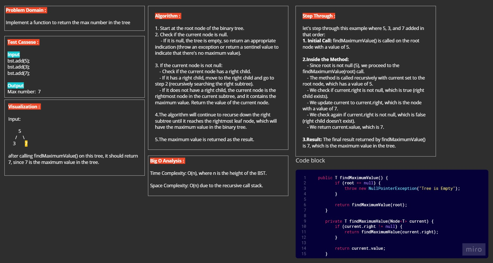

# MAX (Challenge 16)

---

## Description of the challenge

The challenge is to implement a method findMaximumValue() for a binary search tree (BST) that finds and returns the maximum value stored in the tree. If the tree is empty, the method should throw a NullPointerException.

---

## Whiteboard

---

## Approach & Efficiency

The approach used is a recursive algorithm that traverses the BST to find the maximum value. The algorithm starts from the root node and recursively traverses the right subtree until it reaches the rightmost leaf node. Here's the algorithm's efficiency:

- Time Complexity: O(n), where n is the height of the BST.
- Space Complexity: O(n) due to the recursive call stack.

---

## Output

