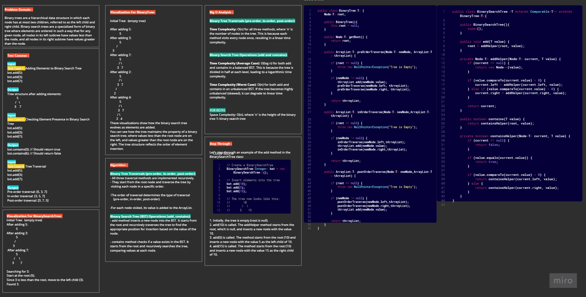
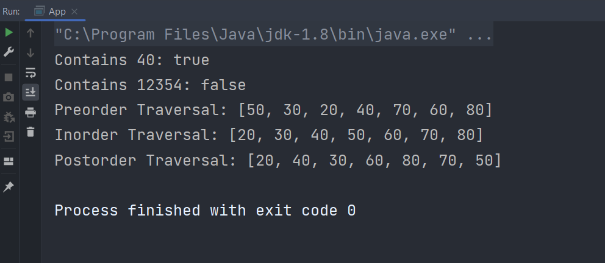
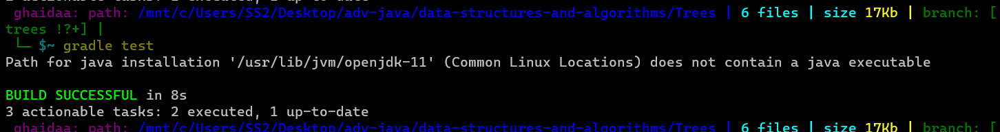

# Trees (Challenge 15)

---

## Description of the challenge

**BinaryTree class:**
- Represents a binary tree.
- Generic class to work with binary trees of any data type.
- Contains a field for the root node reference.
- Provides basic tree traversal methods:
- `preOrderTraverse`: Performs pre-order traversal (root, left, right).
- `inOrderTraverse`: Performs in-order traversal (left, root, right).
- `postOrderTraverse`: Performs post-order traversal (left, right, root).
- Allows retrieval of the root node.

**BinarySearchTree class:**
- Represents a binary search tree (BST), which is a specific type of binary tree.
- Generic class, allowing it to work with binary search trees of any comparable data type (T extends Comparable<T>).
- Extends the BinaryTree class, inheriting its basic tree structure and traversal methods.
- Provides additional methods for managing a binary search tree:
- `add`(T value): Adds a new node with the given value to the binary search tree while maintaining the binary search tree property, if the value already exists in the tree, it won't be added again.
- `contains`(T value): Checks whether a node with the given value exists in the binary search tree.
- Implements the binary search tree property, where all nodes in the left subtree have values less than the current node, and all nodes in the right subtree have values greater than the current node.

---

## Whiteboard



#### For good quality


---

## Approach & Efficiency

### BinaryTree

#### Approach:

-It's a basic binary tree structure without the constraints of a binary search tree. It can be used to represent any binary tree, including binary search trees.
-It provides methods for traversing the tree in pre-order, in-order, and post-order fashion.

#### Efficiency:

**Traversals (pre-order, in-order, post-order):** The time complexity for each of these traversals is O(n), where 'n' is the number of nodes in the tree. This is because you need to visit each node in the tree exactly once to perform the traversal. These traversals have a linear time complexity.

#### BinarySearchTree

#### Approach:

- It's an implementation of a binary search tree (BST), a data structure that maintains the properties of a binary tree where each node has at most two children, and for each node, all elements in its left subtree are less than the node's value, and all elements in its right subtree are greater than the node's value.
- The `add` method inserts elements into the BST while maintaining its structure by recursively traversing the tree and placing elements in the appropriate position.
- The `contains` method checks whether a given value exists in the BST by recursively traversing the tree and comparing values.

#### Efficiency:

- Insertion (`add` method): The average time complexity for inserting an element into a balanced BST is O(log n), where 'n' is the number of elements in the tree. In the worst case (if the tree becomes highly unbalanced), the time complexity can degrade to O(n), which is linear. However, with proper balancing techniques, you can maintain the tree's balance, ensuring efficient insertions.
- Search (`contains` method): Similar to insertion, the average time complexity for searching an element in a balanced BST is O(log n). In the worst case, when the tree is unbalanced, it can also become O(n). Balancing the tree is crucial to ensure efficient search operations.

---

## Solution

### Output





#### code

```java
public class BinaryTree<T> {
    Node<T> root;

    public BinaryTree(){
        this.root = null;
    }

    public Node<T> getRoot() {
        return root;
    }

    public ArrayList<T> preOrderTraverse(Node<T> newNode, ArrayList<T> tArrayList) {

        if (root == null) {
            throw new NullPointerException("Tree is Empty");
        }

        if (newNode != null) {
            tArrayList.add(newNode.value);
            preOrderTraverse(newNode.left, tArrayList);
            preOrderTraverse(newNode.right, tArrayList);
        }

        return tArrayList;
    }

    public ArrayList<T> inOrderTraverse(Node<T> newNode,ArrayList<T> tArrayList) {

        if (root == null) {
            throw new NullPointerException("Tree is Empty");
        }

        if (newNode != null) {
            inOrderTraverse(newNode.left,tArrayList);
            tArrayList.add(newNode.value);
            inOrderTraverse(newNode.right,tArrayList);
        }

        return tArrayList;
    }

    public ArrayList<T> postOrderTraverse(Node<T> newNode,ArrayList<T> tArrayList) {

        if (root == null) {
            throw new NullPointerException("Tree is Empty");
        }

        if (newNode != null) {
            postOrderTraverse(newNode.left,tArrayList);
            postOrderTraverse(newNode.right,tArrayList);
            tArrayList.add(newNode.value);
        }

        return tArrayList;
    }
}

public class BinarySearchTree <T extends Comparable<T>> extends BinaryTree<T>{

    public BinarySearchTree(){
        super();
    }

    public void add(T value) {
        root = addHelper(root, value);
    }

    private Node<T> addHelper(Node<T> current, T value) {
        if (current == null) {
            return new Node<>(value);
        }

        if (value.compareTo(current.value) < 0) {
            current.left = addHelper(current.left, value);
        } else if (value.compareTo(current.value) > 0) {
            current.right = addHelper(current.right, value);
        }

        return current;
    }

    public boolean contains(T value) {
        return containsHelper(root, value);
    }

    private boolean containsHelper(Node<T> current, T value) {
        if (current == null) {
            return false;
        }

        if (value.equals(current.value)) {
            return true;
        }

        if (value.compareTo(current.value) < 0) {
            return containsHelper(current.left, value);
        } else {
            return containsHelper(current.right, value);
        }
    }
}
```

