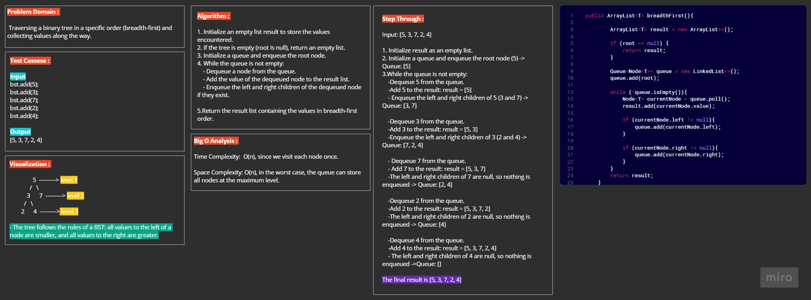
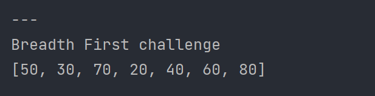

#  Breadth-First Traversal (Challenge 17)

---

## Description of the challenge

The challenge is to perform a breadth-first traversal of a binary tree and return a list of all the values encountered in the order they were encountered.

---

## Whiteboard

---

## Approach & Efficiency

- The approach used is a typical Breadth-First Search (BFS) algorithm.
- It starts from the root of the tree and explores all nodes at the current level before moving to the next level.
- A queue data structure is used to keep track of nodes at each level.
- The algorithm has a time complexity of O(n), where 'n' is the number of nodes in the tree, as it visits each node exactly once.

---

## Output

