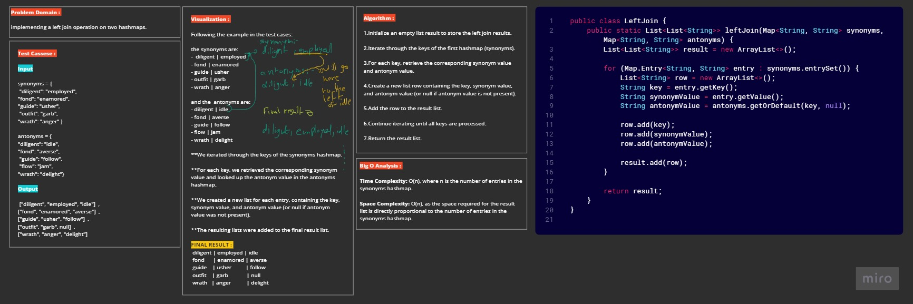

# Left Join CodeChallenge 33

Implementing a left join operation on two hashmaps.
The first hashmap contains word strings as keys and synonyms as values, while the second hashmap contains word strings as keys and antonyms as values.
The goal is to perform a left join, combining the keys and corresponding values (if they exist) into a new data structure, adhering to the LEFT JOIN logic.

---

## Whiteboard



---

## Approach & Efficiency

The approach involves iterating through the keys of the synonyms hashmap and creating a new list for each entry. The efficiency is high, as it only requires a single pass through the data. The algorithm is straightforward and easy to understand, making it efficient for this specific task.

- Time Complexity: O(n), where n is the number of entries in the synonyms hashmap.
- Space Complexity: O(n), as the space required for the result list is directly proportional to the number of entries in the synonyms hashmap.

---

## Solution

[LeftJoin Class](app%2Fsrc%2Fmain%2Fjava%2Fhashtable%2FLeftJoin.java)

```java
public class LeftJoin {
    public static List<List<String>> leftJoin(Map<String, String> synonyms, Map<String, String> antonyms) {
        List<List<String>> result = new ArrayList<>();

        for (Map.Entry<String, String> entry : synonyms.entrySet()) {
            List<String> row = new ArrayList<>();
            String key = entry.getKey();
            String synonymValue = entry.getValue();
            String antonymValue = antonyms.getOrDefault(key, null);

            row.add(key);
            row.add(synonymValue);
            row.add(antonymValue);

            result.add(row);
        }

        return result;
    }
}
```