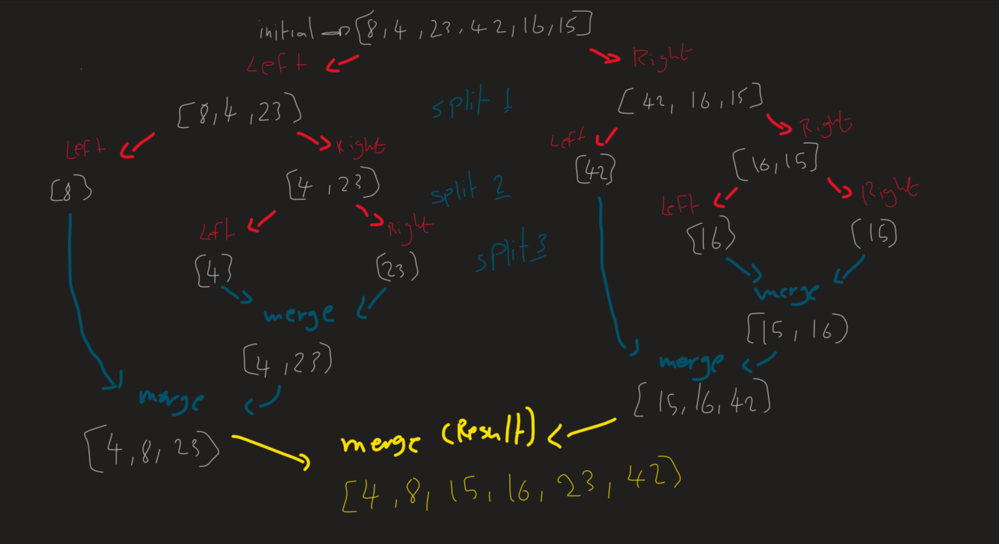

# Merge Sort

Merge Sort is a highly efficient and predictable sorting algorithm with stable performance. 
Its divide-and-conquer approach and O(n log n) time complexity make it a popular choice for various applications, especially when stability and predictability are essential.
First divide the array into smaller sub-arrays, these smaller arrays when the length of them become 1 then will compare and combine them together to get a full sorted array as a result. 

---

# Pseudocode

```
ALGORITHM Mergesort(arr)
    DECLARE n <-- arr.length

    if n > 1
      DECLARE mid <-- n/2
      DECLARE left <-- arr[0...mid]
      DECLARE right <-- arr[mid...n]
      // sort the left side
      Mergesort(left)
      // sort the right side
      Mergesort(right)
      // merge the sorted left and right sides together
      Merge(left, right, arr)

ALGORITHM Merge(left, right, arr)
    DECLARE i <-- 0
    DECLARE j <-- 0
    DECLARE k <-- 0

    while i < left.length && j < right.length
        if left[i] <= right[j]
            arr[k] <-- left[i]
            i <-- i + 1
        else
            arr[k] <-- right[j]
            j <-- j + 1

        k <-- k + 1

    if i = left.length
       set remaining entries in arr to remaining values in right
    else
       set remaining entries in arr to remaining values in left
```

---

# Code

```java
   public class MergeSort {

    public static void mergeSort(int[] arr) {
        if (arr.length > 1) {
            int mid = arr.length / 2;

            int[] left = new int[mid];
            int[] right = new int[arr.length - mid];

            System.arraycopy(arr, 0, left, 0, mid);
            System.arraycopy(arr, mid, right, 0, arr.length - mid);

            mergeSort(left);
            mergeSort(right);

            merge(arr, left, right);
        }
    }

    public static void merge(int[] arr, int[] left, int[] right) {
        int i = 0, j = 0, k = 0;

        while (i < left.length && j < right.length) {
            if (left[i] <= right[j]) {
                arr[k] = left[i];
                i++;
            } else {
                arr[k] = right[j];
                j++;
            }
            k++;
        }

        while (i < left.length) {
            arr[k] = left[i];
            i++;
            k++;
        }

        while (j < right.length) {
            arr[k] = right[j];
            j++;
            k++;
        }
    }
}
```

---

# Trace



---

# Big (O)

- Time complexity: O(n log n) it's because at each level of recursion, the array is divided into two halves, and the merging step takes linear time. The recursive call tree has log(n) levels, and at each level, we perform linear operations during merging.

Divide: O(log n)
Merge: O(n)
So at the end the complexity here is: O(n log n).

- Space complexity: O(n) it's because, at any given time during the merging process, there are two temporary arrays (left and right) that each have a maximum size of n/2.

Arrays left and right: O(n)
Other variables (i, j, k, mid): O(1)
So at the end the complexity here is: O(n).